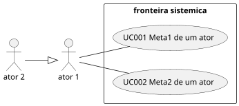

# Projeto: garantia de Qualidade

## Diagrama de casos de uso

```plantuml
@startuml

left to right direction
scale 0.8

actor "ator 1" as actor01
actor "ator 2" as actor02


rectangle "fronteira sistemica"{
    usecase "UC001 Meta1 de um ator" as UC001
    usecase "UC002 Meta2 de um ator" as UC002

}

actor01 -- UC001
actor01 -- UC002

actor02 --|> actor01


@enduml
```
