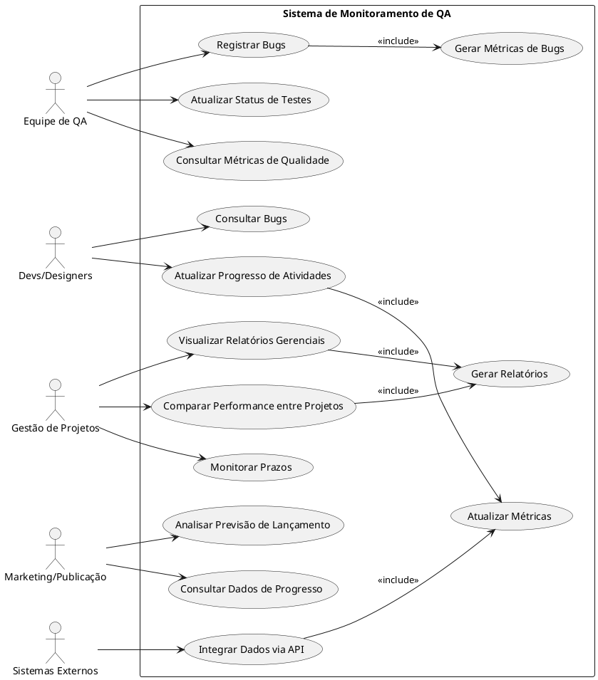

# Projeto: Garantia de Qualidade

## Diagrama de Casos de Uso

```plantuml
@startuml
left to right direction

actor "Equipe de QA" as QA
actor "Devs/Designers" as Dev
actor "Gestão de Projetos" as GP
actor "Marketing/Publicação" as MKT
actor "Sistemas Externos" as EXT

rectangle "Sistema de Monitoramento de QA" {

    QA --> (Registrar Bugs)
    QA --> (Atualizar Status de Testes)
    QA --> (Consultar Métricas de Qualidade)

    Dev --> (Atualizar Progresso de Atividades)
    Dev --> (Consultar Bugs)

    GP --> (Visualizar Relatórios Gerenciais)
    GP --> (Comparar Performance entre Projetos)
    GP --> (Monitorar Prazos)

    MKT --> (Consultar Dados de Progresso)
    MKT --> (Analisar Previsão de Lançamento)

    EXT --> (Integrar Dados via API)

    (Registrar Bugs) --> (Gerar Métricas de Bugs) : <<include>>
    (Atualizar Progresso de Atividades) --> (Atualizar Métricas) : <<include>>
    (Integrar Dados via API) --> (Atualizar Métricas) : <<include>>

    (Visualizar Relatórios Gerenciais) --> (Gerar Relatórios) : <<include>>
    (Comparar Performance entre Projetos) --> (Gerar Relatórios) : <<include>>
}

@enduml
```
