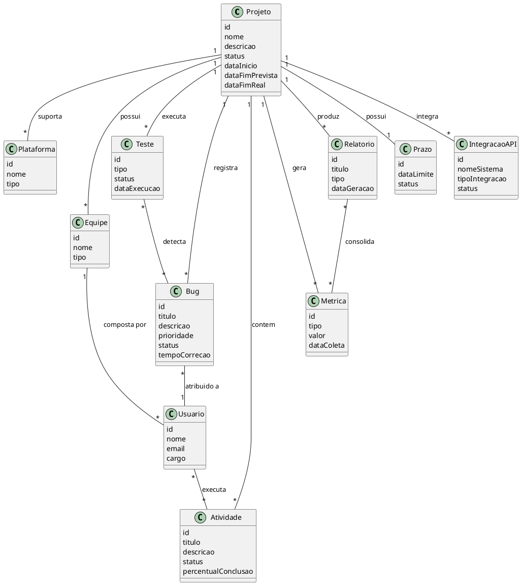

# Entidades de Domínio - Projeto Garantia de Qualidade (QA)

## Diagrama de Classes Conceitual

## Descrição das Entidades

- **Projeto**: representa cada projeto de desenvolvimento de jogos monitorado pelo sistema.
- **Plataforma**: identifica as plataformas suportadas (PC, console, mobile).
- **Equipe**: grupos responsáveis por desenvolvimento, design ou QA.
- **Usuario**: membros das equipes que executam atividades e tratam bugs.
- **Atividade**: tarefas relacionadas ao progresso do projeto.
- **Bug**: falhas registradas durante desenvolvimento e testes.
- **Teste**: validações executadas para garantir qualidade.
- **Metrica**: indicadores coletados, como quantidade de bugs e progresso.
- **Relatorio**: consolidação gerencial das métricas e indicadores.
- **Prazo**: controle de datas e acompanhamento de deadlines.
- **IntegracaoAPI**: integração com ferramentas externas via API.
