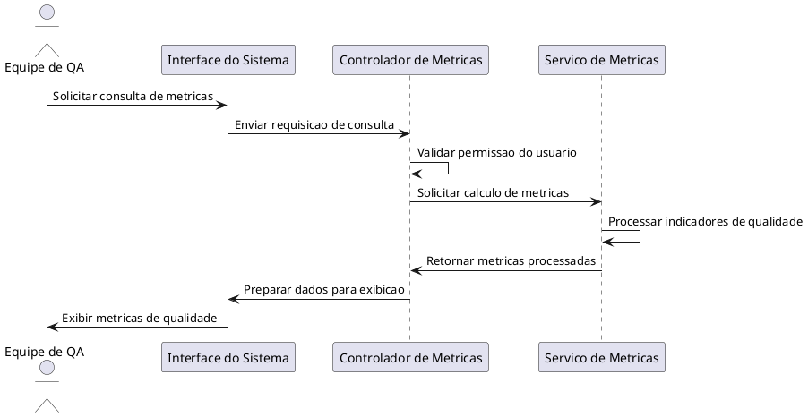

# UC003 – Luiz Filipe de Almeida Tannus -10418230 - Consultar Métricas de Qualidade

## Ator Principal
Equipe de QA

## Descrição
Este caso de uso permite que a Equipe de QA consulte métricas de qualidade do sistema,
como quantidade de bugs, status dos testes e indicadores gerais de qualidade do projeto.

## Fluxo Principal
1. A Equipe de QA acessa o Sistema de Monitoramento de QA.
2. O sistema apresenta a opção de consulta de métricas de qualidade.
3. A Equipe de QA solicita a consulta das métricas.
4. O sistema requisita os dados ao módulo de métricas.
5. O módulo de métricas retorna os dados de qualidade.
6. O sistema exibe as métricas de qualidade para a Equipe de QA.

## Diagrama de Sequência

