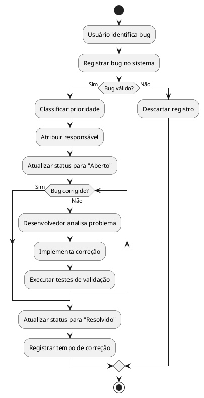
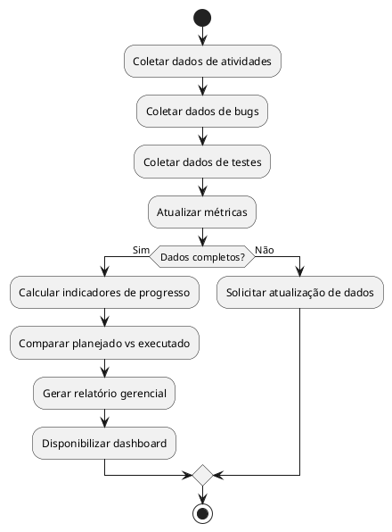

# Processos - Projeto Garantia de Qualidade (QA)

## Processo 1: Registro e Tratamento de Bugs

---

## Processo 2: Monitoramento de Progresso e Geração de Relatórios

---

## Descrição dos Processos

### Processo 1 - Registro e Tratamento de Bugs
Este processo descreve o fluxo de identificação, registro, classificação, correção e validação de bugs encontrados durante o desenvolvimento dos projetos.

### Processo 2 - Monitoramento de Progresso e Geração de Relatórios
Este processo representa a consolidação de informações dos projetos para geração de métricas, acompanhamento de desempenho e apoio à tomada de decisão gerencial.