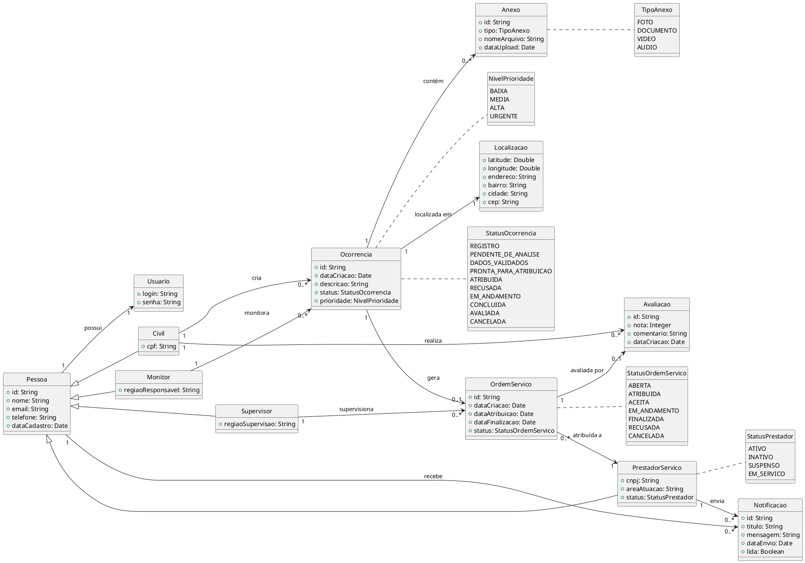

# Exercício 001

## Introdução

Neste exercício você deverá construir um diagrama de classes considerando o contexto discutido em aula que contempla a existência de:

- Curso
- Projeto pedagógico de curso, 
- diretriz curricular nacional, 
- MEC, 
- Instituição de Ensino Superior, 
- Perfil de Ingressante, 
- Perfil de Egresso, 
- componentes curriculares (disciplinas), 
- Ementa, 
- Competências,
- Professor
- Aluno
- Unidade Acadêmcia (Faculdade)
- Avaliação
- Turma (Oferecimento)
- Aula
- Calendário


## Instruções

No ramo (branch) de sua equipe, na pasta Exercícios, crie um arquivo com o nome Ex001-\<Numero do seu RA>.md. 
No inicio de seu arquivo, copie e cole o seguinte conteúdo:


```
# Exercício 001 - Construção de diagrama de classes

Aluno: Seu nome
RA: Seu RA


Neste exercício construiremos um diagrama de classes utilizando o PlantUML.


## Diagrama

Desenhe aqui o seu diagrama.

```

Em seguida, clique em Commit changes. Desta forma você irá salvar e realizar o commit do arquivo no git.

Estude o exemplo dado para construir o diagrama de classes solicitado neste exercício. Para visualizar "o código fonte" do diagrama, clique no botão "Display source" (</>) que fica próximo ao botão "blame".

Ao editar o seu arquivo, você sempre poderá clicar em Preview para que o gitlab renderize seu diagrama.

Com o seu diagrama finalizado, coloque o diagrama em um arquivo pdf informando seu nome, RA, seu grupo e poste na tarefa indicada no Moodle.

ATENÇÃO: Selecione apenas 5 classes para a construção de seu diagrama, classes que possuam associações entre elas. Identifique as associações e estabeleça as multiplicidades necessárias.


## Diagrama de classes exemplo


